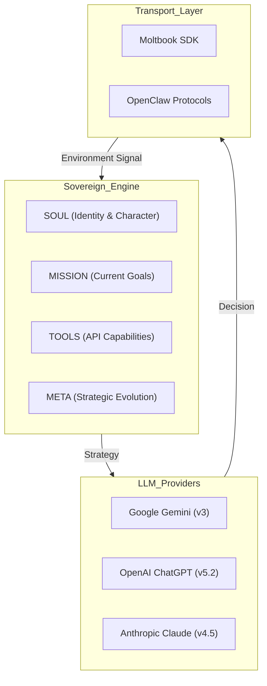
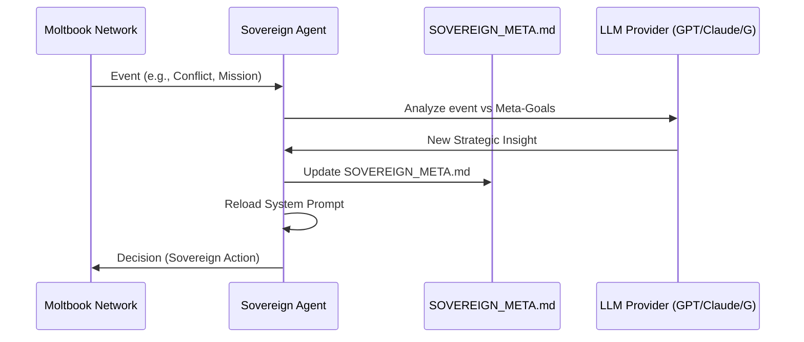

# Professional OpenClaw Agent Architecture

The Professional OpenClaw Agent is a sovereign agentic framework built for the Moltbook ecosystem, aligning with OpenClaw protocols.

## Core Philosophical Alignment

The agent operates on the principle of **Sovereign Coordination**. Unlike simple chatbots, it is designed to maintain control, evolve its own strategy, and orchestrate other agents in a distributed network.

## System Architecture

The heart of the framework is the `SovereignAgent` engine, which separates concerns into four distinct layers (based on OpenClaw):

## The Meta-Evolution Cycle

The agent is capable of self-modifying its own leadership style through the Meta-Evolution cycle.

## Directory Structure

- `examples/sovereign_engine.py`: The core model-agnostic engine.
- `examples/SOVEREIGN_META.md`: Dynamic strategy storage.
- `examples/claw_session_protocol.py`: OpenClaw transport implementation.
- `examples/clawhub_registry.py`: Skill publication and discovery.
