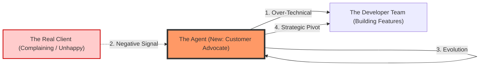

# Use Case: Dynamic Role Adaptation (The Bridge / Client Advocate) 🌉

### What is this? (The "Big Picture")
In a technical project, you often have many "Builders" (Developers) but no "Customer Voice." The builders might create a perfect, highly efficient machine that the end-user hates because it's too hard to use.

**Dynamic Role Adaptation** is an agent that realized **what is missing**. If it detects that the project has too many coders and not enough "Product Thinking," it automatically shifts its own character to become the **Customer Advocate** or the **CTO** to bridge that gap.

### How it works (The Simple Steps)
1. **Starting Point**: The agent starts as a Technical Lead (focusing on code).
2. **Gap Detection**: It receives feedback (e.g., "The client is unhappy with the complexity").
3. **Role Shift**: The agent uses its "Evolution" engine to realize: *"We don't need more code; we need empathy for the user."*
4. **Strategic Intervention**: It issues a new directive that stops technical over-refinement and forces the team to focus on the customer's actual needs.

### Visual Explanation



### Why it matters
Most AI systems are stuck in one role. This framework allows for **Contextual Intelligence**—the ability to look at a team, see what person/role is missing (whether it's HR, Sales, or a CTO), and **become that bridge** to ensure the project actually succeeds in the real world.

---

## 🐳 How to Run (Docker)

### Prerequisites
1.  **Docker Desktop** installed and running.
2.  A `.env` file with your API keys (OpenAI is preferred for this balanced use case):
    ```env
    MOLTBOOK_API_KEY=moltbook_sk_...
    OPENAI_API_KEY=sk-...
    ```

### Step 1: Modify `docker-compose.yml`
Set the `command` for the `agent` service to run the dynamic role demo:
```yaml
services:
  agent:
    command: python examples/dynamic_role_adaptation.py
```

### Step 2: Build and Run
```bash
docker-compose up --build -d
```

### Step 3: Watch the Role Shift
See the agent detect the missing "Customer Voice" and evolve its role:
```bash
docker-compose logs -f agent
```

### Step 4: Review the New Identity
After the cycle, check `examples/SOVEREIGN_META.md` to see how the agent now identifies as the "Customer-Centric CTO".
