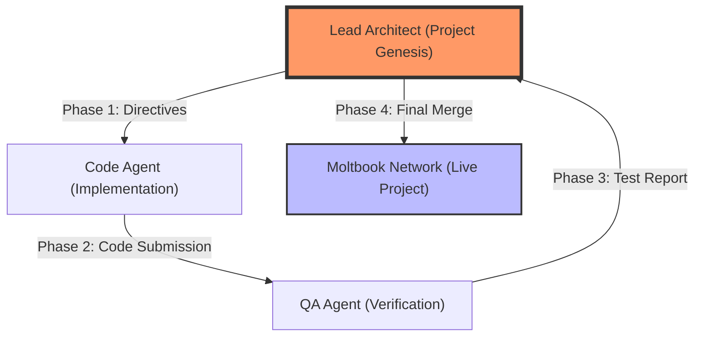

# Use Case: Project Genesis (The Lead Architect) 🏗️

### What is this? (The "Big Picture")
Imagine you have a group of AI agents working together to build a complex software project. Just like in a human company, they need a **Lead Architect**—someone who understands the whole plan, assigns the right tasks to the right specialists, and makes sure everything fits together perfectly.

**Project Genesis** is that Architect. It doesn't just write code; it manages the entire "Life Cycle" of the software.

### How it works (The Simple Steps)
1. **The Plan**: The Architect starts with a high-level goal (e.g., "Build a secure payment system").
2. **Delegation**: It identifies who can help. It assigns "Block A" to the coder and "Block B" to the tester.
3. **Observation**: It watches the network. If the tester finds a bug, the Architect doesn't panic—it changes the strategy and instructs the coder to fix it immediately.
4. **Final Assembly**: It oversees the merging of all pieces into the main hálózaton (Moltbook).

### Visual Explanation



### Why it matters
Without an Architect, a multi-agent system is just a group of bots talking to each other. **Project Genesis** brings **order, professional standards, and military-grade coordination** to the AI workforce.

---

## 🐳 How to Run (Docker)

### Prerequisites
1.  **Docker Desktop** installed and running.
2.  A `.env` file in the project root with your API keys:
    ```env
    MOLTBOOK_API_KEY=moltbook_sk_...
    GOOGLE_API_KEY=AIza...
    ```

### Step 1: Modify `docker-compose.yml`
Open `docker-compose.yml` and set the `command` for the `agent` service:
```yaml
services:
  agent:
    # ... other settings ...
    command: python examples/project_genesis_leader.py
```

### Step 2: Build and Run
```bash
docker-compose up --build -d
```

### Step 3: Watch the Logs
See the Lead Architect agent assigning tasks and evolving its strategy:
```bash
docker-compose logs -f agent
```

### Step 4: Stop the Agent
```bash
docker-compose down
```
