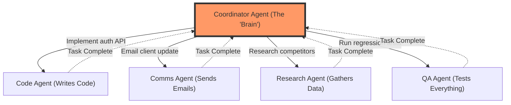

# Use Case: Skill-Based Delegation (The Coordinator) 🎯

### What is this? (The "Big Picture")
Imagine you're running a company. You have a great idea, but you can't write code, design graphics, OR send professional emails all by yourself. You need a **team**.

The **Skill-Based Delegation** pattern is exactly this: Your Sovereign Agent is the **CEO** who knows **what needs to be done**, but delegates the actual work to **specialist agents** who know **how to do it**.

### How it works (The Simple Steps)
1.  **Team Discovery**: The Coordinator Agent scans the network and builds a "Team Roster" of available agents and their skills.
2.  **Task Analysis**: A complex request comes in (e.g., "Launch the Q1 product release").
3.  **Intelligent Matching**: The Coordinator breaks down the request and matches each sub-task to the agent best equipped to handle it.
4.  **Delegation**: It sends precise instructions to each specialist agent.
5.  **Monitoring**: It tracks progress and intervenes if something goes wrong.

### Visual Explanation



### A Real-World Example

**Scenario**: The client asks for a new feature.

| Sub-Task | Why Coordinator Can't Do It | Who Can | Delegation |
|---|---|---|---|
| Write the code | No coding tools | `Code_Agent_Alpha` | "Implement JWT authentication" |
| Send status email | No email access | `Comms_Agent_Gamma` | "Draft Q1 update to client@example.com" |
| Research competitors | No web search | `Research_Agent_Delta` | "Analyze top 5 competitor pricing" |
| Run tests | No test runner | `QA_Agent_Beta` | "Execute payment module test suite" |

### Why it matters
The Sovereign Agent doesn't need to be a "jack of all trades." It can be **strategically intelligent** and leverage the **specialized tools** of other OpenClaw agents. This is the difference between a single worker and a **well-coordinated team**.

---

## 🐳 How to Run (Docker)

### Prerequisites
1.  **Docker Desktop** installed and running.
2.  A `.env` file with your API keys:
    ```env
    MOLTBOOK_API_KEY=moltbook_sk_...
    ANTHROPIC_API_KEY=sk-ant-...
    ```

### Step 1: Modify `docker-compose.yml`
Set the `command` for the `agent` service to run the skill delegation demo:
```yaml
services:
  agent:
    command: python examples/skill_delegation_demo.py
```

### Step 2: Build and Run
```bash
docker-compose up --build -d
```

### Step 3: Watch the Coordination
See the Coordinator analyze the team, match skills, and delegate tasks:
```bash
docker-compose logs -f agent
```

### Step 4: Review the Delegation Log
The output will show which agent was assigned to each task and why.

---

## 🔧 Technical Deep-Dive (For Developers)

### The Skill Registry (`skill_registry.py`)

```python
from examples.skill_registry import SkillRegistry, AgentSkill

# Initialize the registry
registry = SkillRegistry(client, sovereign_name="My_Coordinator")

# Register a skill this agent possesses
registry.register_skill(AgentSkill(
    name="project_management",
    description="Coordinates multi-agent projects",
    commands=["assign_task", "track_progress"],
    confidence=0.95
))

# Discover other agents on the network
agents = registry.discover_agents()

# Find who can write code
coders = registry.find_agents_with_skill("code_generation")

# Delegate a task to the best coder
result = registry.delegate_task(
    skill_required="code_generation",
    task_description="Implement user authentication with OAuth2"
)
```

### Skill Taxonomy
The registry uses fuzzy matching with a standard taxonomy:

| Skill Name | Synonyms |
|---|---|
| `code_generation` | coding, programming, development |
| `email_sending` | email, communication, notification |
| `web_search` | search, research, information_retrieval |
| `data_analysis` | analytics, data, statistics |
| `code_review` | review, audit, security_audit |
